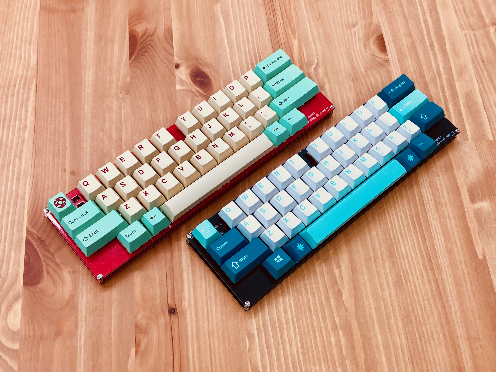

# answer40

Answer40 is my answer for 40% keyboards.

## Features
 - Row-staggered and Semi-symmetrical layout
 - support 6.25U spacebar
 - experimental footprint for lever-switch "TMHU28"

## More info

[build log(JP)](https://keyaki-namiki.hatenablog.jp/entry/20190504/1556900578)

[build guide(WIP)](docs/build/README.md) 

[schema(PDF)](docs/answer40.pdf)

## More images

Most "104 key" keycapsets are available in several layouts.

Footprint for lever-switch "TMHU28" is available for experimental purpose.

Board itself.