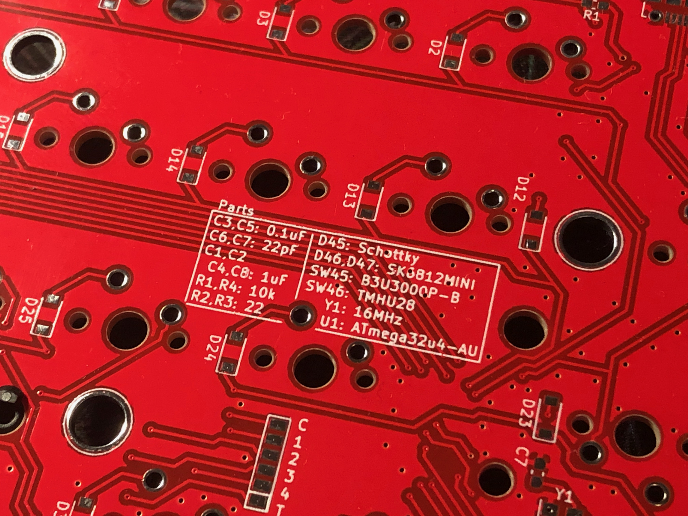
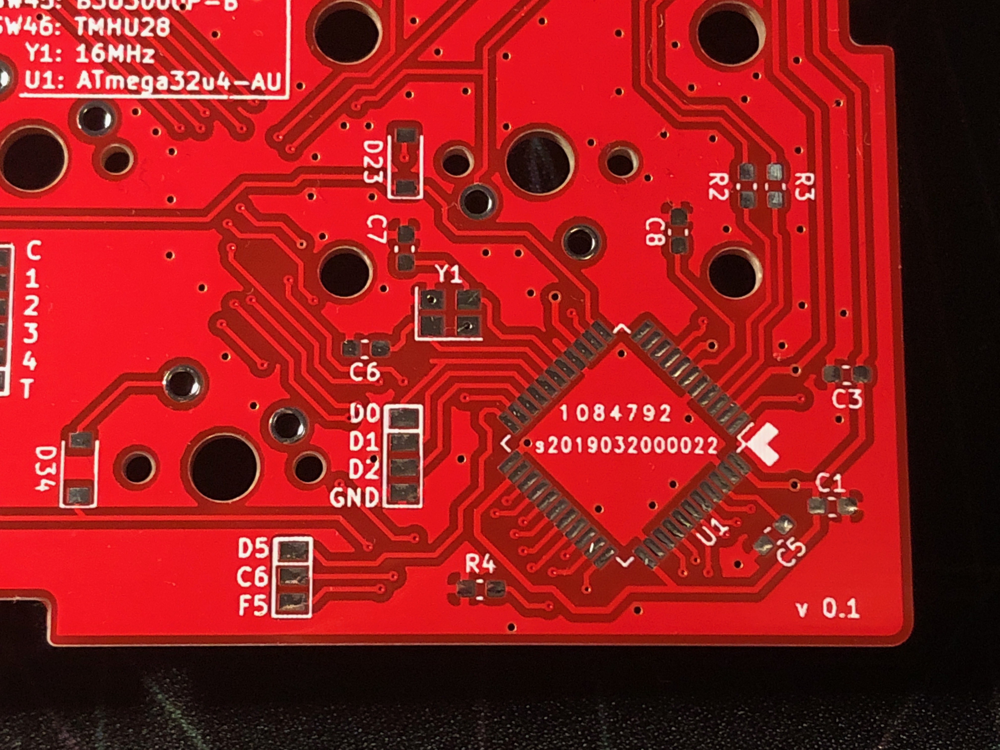

# answer40 build guide(WIP)

## Parts list
|Designator|Description|Value|
|---|---|---|
|C1,C2,C4,C8|capacitor(1608)|1uF|
|C3,C5|capacitor(1608)|0.1uF|
|C6,C7|capacitor(1608)|22pF|
|R1,R4|Resistor(1608)|10k|
|R2,R3|Resistor(1608)|22|
|J1|Micro-B USB connector|Molex 1050170001|
|SW1-44(not marked)|MX compatible keyswitch|--|
|SW45|Reset switch|OMRON B3U-3000P-B|
|D1-44|Diodes|1N4148W|
|D45|Schottky diode|RB160M-30TR|
|D46,D47|Full colour LED|SK6812MINI|
|Y1|Crystal(16MHz)|FA-238|

## Required tools
|Tool(s)|Notes|
|---|---|
|Soldering iron/station|temperature-adjustable type is highly recommended|
|Solder|0.6~0.8mm diameter|
|Tweezers|This keyboard uses very small parts|

## Follow the silkscreen printed table

